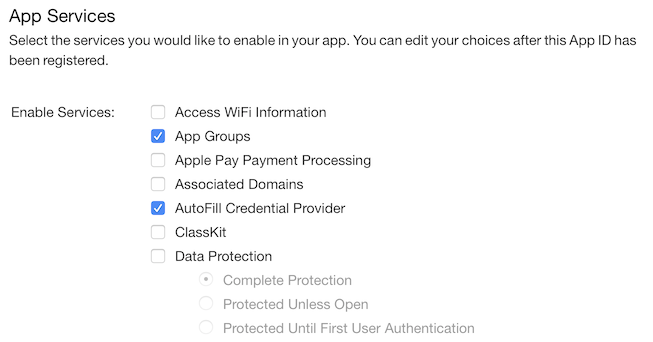
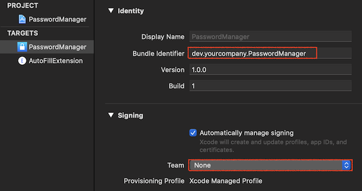
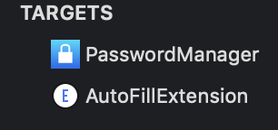
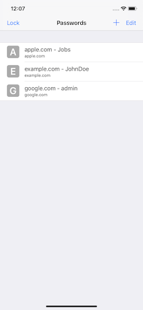
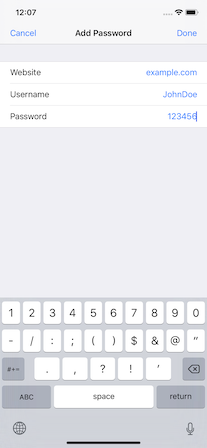
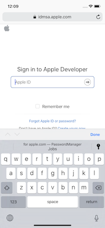
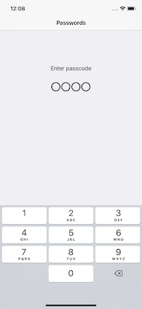

# AppPattern: PasswordManager

[](https://opensource.org/licenses/MIT)


This is an implementation example of an application feature called "PasswordManager".
The PasswordManager manages usernames and passwords for sites.

- [Features](#Features)
- [Requirements](#requirements)
- [Author](#author)
- [License](#license)

## Features
- [x] Sample code of AuthenticationServices framework.
- [x] List passwords.
- [x] Add or Edit passwoed.
- [x] Support QuickType.
- [x] Lock screen.

## Requirements

* iOS 12.0+
* Xcode 10.0+
* Swift 4.2+

### Setup

1. Create an AppID with `App Groups` and `AutoFill Credential Provider` enabled.

   

2. Update `Bundle Identifier` and `Signing` to match created AppID.

   

3. Update values both Container App and Extension.

   

4. Update value of [AppGroup.swift](PasswordManager/AppGroup.swift) file.

	```swift
	let appGroup = "group.dev.yourcompany.PasswordManager"
	```

## Screenshots






## Author

Watanabe Toshinori – toshinori_watanabe@tiny.blue

## License

This project is licensed under the MIT License. See the [LICENSE](LICENSE) file for details.
